# BasicIndividualComprehensiveManagement
个人综合管理小程序 亮点：Echarts数据看板、健康数据记录与趋势查看、目标拆解和进度管理、日程待办与番茄钟、习惯打卡、收支统计、个人生活记录、跨模块智能提醒； 角色：用户、管理员；

所有源码均本人开发，项目是前后端分离的，所有的项目都具备了完整的业务逻辑，不仅仅局限于基础的增删改查（CRUD）操作，系统亮点众多。

本文注重于计算机毕业设计选题指导，列出题目均有源码， 大家可以去【公众号】(毕业终点站)获取或者加我【qq】(2112698948)提意见(别忘记Star哟)。备注：git

声明：仅用于学习使用，请勿用于任何商业行为！

1.系统非商用，非开源，非无偿。

2.由本人开发，如需源码，请联系以下方式，qq:2112698948。

3.项目有很多，并未全部上传，如果未找到想要的，可直接咨询。

# 个人综合管理小程序（Echarts 数据看板 · 健康记录与趋势 · 目标拆解与进度 · 日程待办与番茄钟 · 习惯打卡 · 收支统计 · 跨模块智能提醒）

> 本仓库为「个人综合管理小程序」毕业设计项目的展示文档，截图存放于仓库 `images/` 目录，不依赖外部图床。

## 一、项目简介

基础个人综合管理系统采用前后端分离架构，由面向普通用户的 uni-app 微信小程序、面向管理员的 Web 管理端和 Spring Boot 服务端组成。系统围绕个人健康、目标、时间、收支及生活记录等日常管理场景，将健康记录、目标任务、日程待办、习惯打卡、番茄钟、收支、物品、备忘录和日记等数据集中管理。普通用户可通过小程序完成个人数据维护、统计查看和提醒消息查阅；管理员可通过管理端维护用户、健康标准、收支分类、习惯模板、联动规则、公告与反馈，并查看平台运营和使用情况。

## 二、技术架构

| 层级 | 主要技术与职责 |
| :--- | :--- |
| 用户端 | uni-app、Vue 3、Pinia、uni-ui、SCSS；提供账号登录、个人首页、健康记录、目标管理、日程待办、习惯打卡、番茄钟、收支统计、生活记录和个人服务入口。 |
| 管理端 | Vue 3、Vite、Element Plus、Pinia、Axios、ECharts；用于用户、健康数据、收支分类、习惯模板、联动规则、反馈、公告和运营数据的维护与分析。 |
| 服务端 | Spring Boot 3.3.1、Java 17、MyBatis-Plus、MySQL、JWT；提供 REST 接口、当前用户解析、分页查询、业务处理、静态资源访问及数据持久化能力。 |
| 数据与资源 | 以用户、健康记录、目标与任务、日程与待办、习惯打卡、收支及分类、物品与借还、备忘录、日记、提醒、规则、公告和反馈等数据表支撑业务流程，并支持图片、文件等资源上传与访问。 |

## 三、系统亮点（核心功能）

1. **3.1 用户账号、角色与登录状态** — 普通用户与管理员双角色，小程序端完成注册、登录与微信绑定，服务端签发 JWT 并解析当前用户与角色，为菜单跳转与个人数据归属提供依据。
2. **3.2 健康记录、标准配置与趋势查看** — 按日记录步数、睡眠、饮食、体重与饮水，健康中心对照标准展示，趋势页查看指标变化；管理端维护步数目标等健康标准。
3. **3.3 目标规划、任务拆解与进度联动** — 创建目标并维护进度，拆分为子任务独立切换完成状态，首页与目标中心读取进度，任务可一键加入日程。
4. **3.4 日程、待办、番茄钟与习惯打卡** — 日历日程、待办筛选切换、番茄钟专注计时与记录、习惯每日打卡及连续/累计统计，汇成个人时间投入分析。
5. **3.5 收支管理与个人生活记录** — 收支按方向、分类与日期记录并统计趋势与占比；另含物品清单、借还记录、备忘录与日记，覆盖个人生活信息沉淀。
6. **3.6 跨模块联动规则与智能提醒** — 管理员配置触发条件与阈值，定时任务遍历用户健康、待办、习惯与收支数据，命中后写入提醒并记录执行日志（当日同规则只执行一次）。
7. **3.7 公告、意见反馈与后台运营维护** — 管理员发布公告、集中处理用户反馈形成提交—处理—查看回复流程，并维护账号、习惯模板与基础配置。
8. **3.8 多角色协作与数据分析** — 管理端以 ECharts 呈现用户活跃、模块使用与健康数据分布，首页数据看板汇总核心业务量；用户端首页聚合个人多维概览。
9. **3.9 前后端分离与统一服务支撑** — 服务端 Controller/Service/Mapper 分层提供统一接口，MyBatis-Plus 与 MySQL 持久化；小程序 Pinia 与管理端路由守卫复用同一套接口与数据模型。

## 四、功能截图

### 平台总览

**图 1 · 平台总览**

**图 2 · 平台总览**

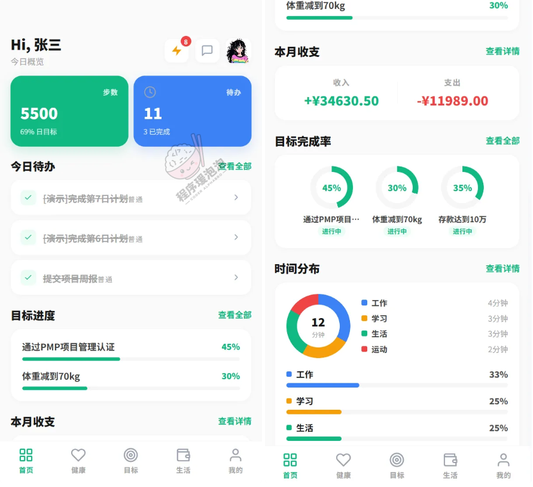

**图 3 · 平台总览**

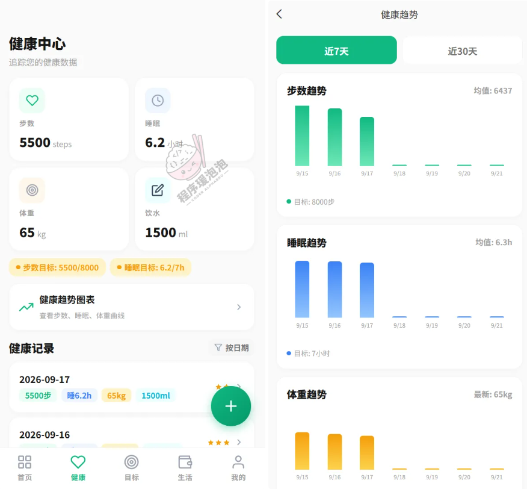

**图 4 · 平台总览**

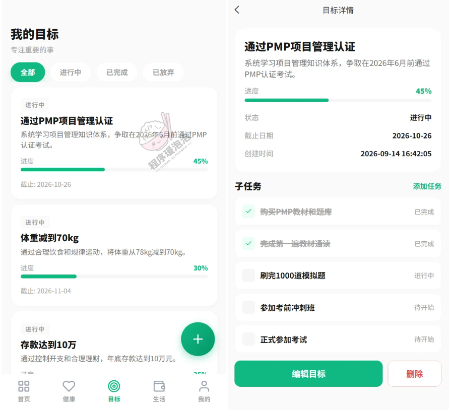

**图 5 · 平台总览**

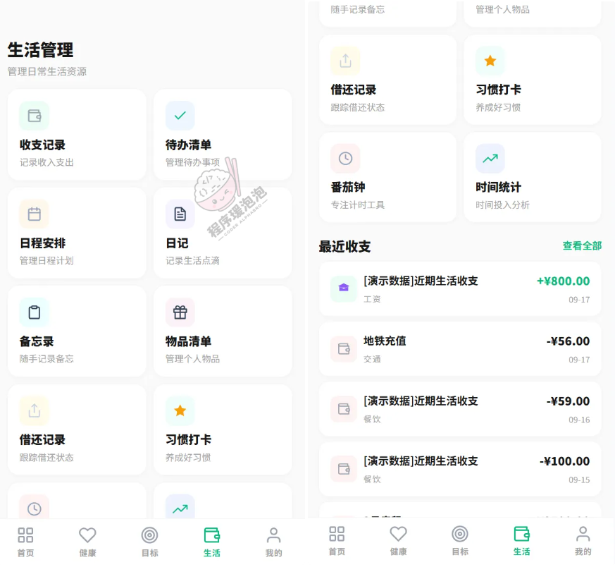

**图 6 · 平台总览**

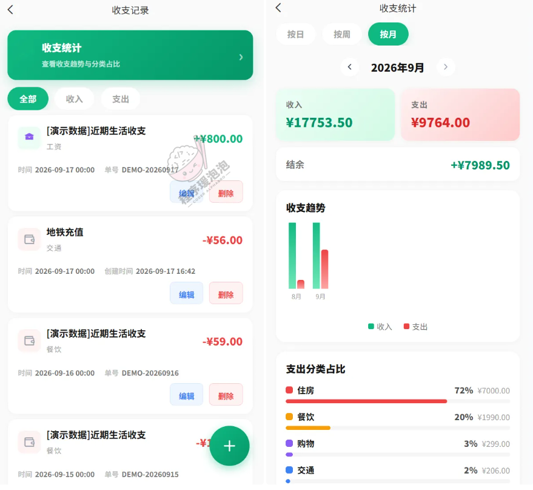

**图 7 · 平台总览**

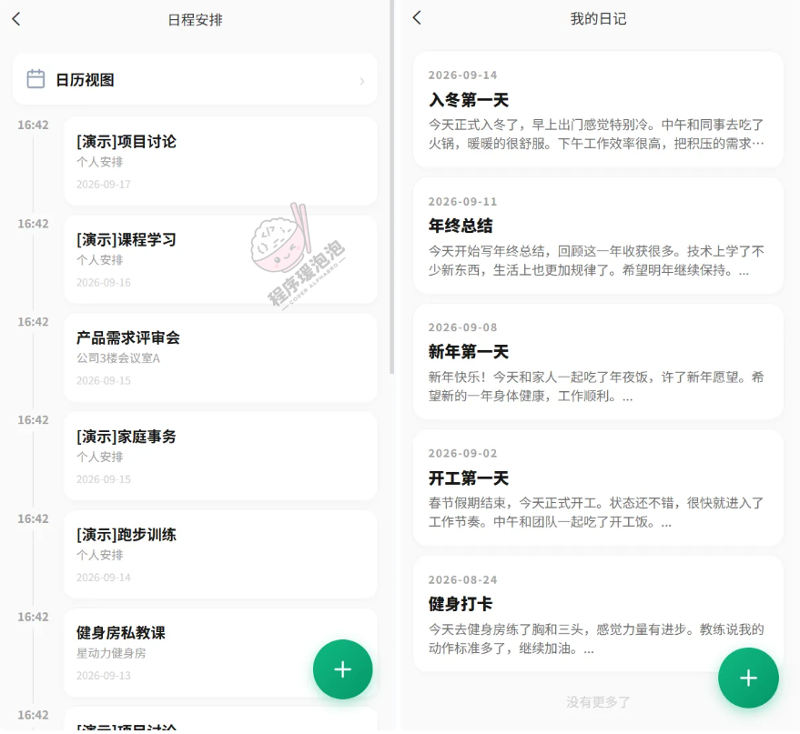

**图 8 · 平台总览**

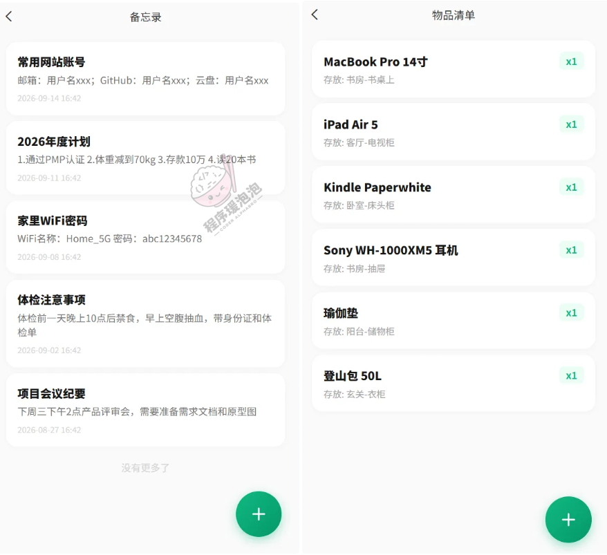

**图 9 · 平台总览**

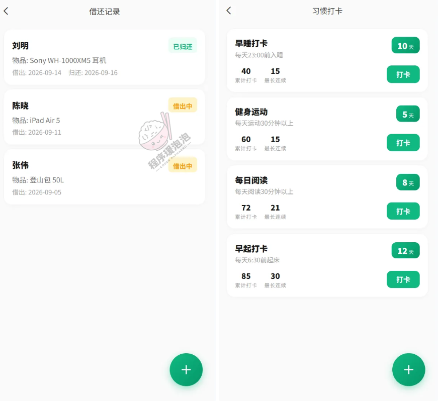

**图 10 · 平台总览**

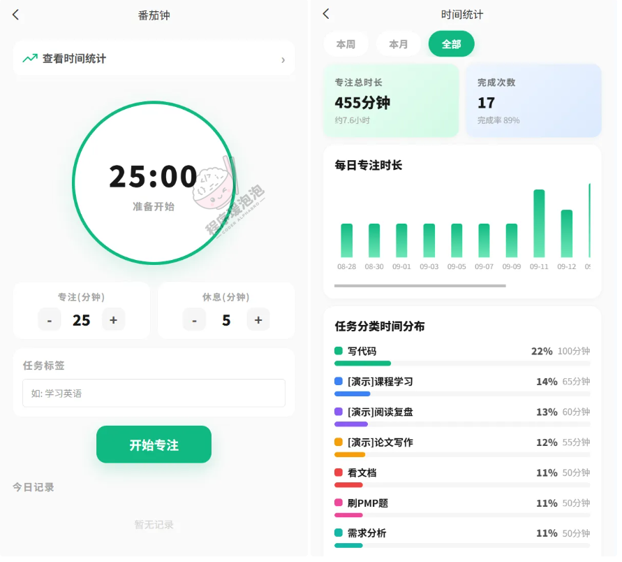

**图 11 · 平台总览**

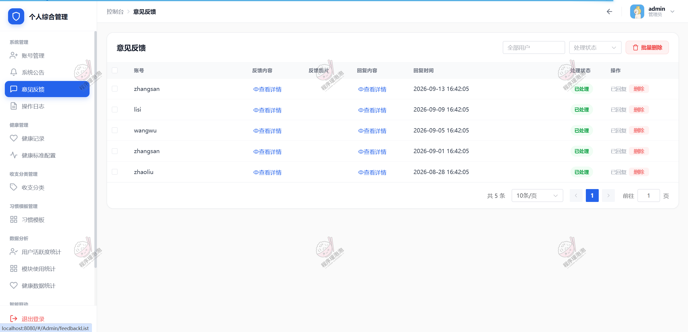

**图 12 · 平台总览**

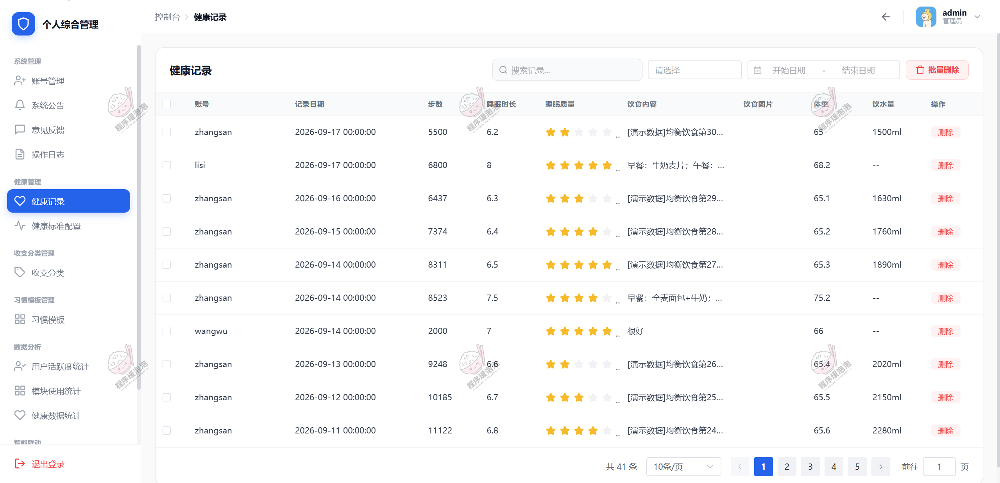

**图 13 · 平台总览**

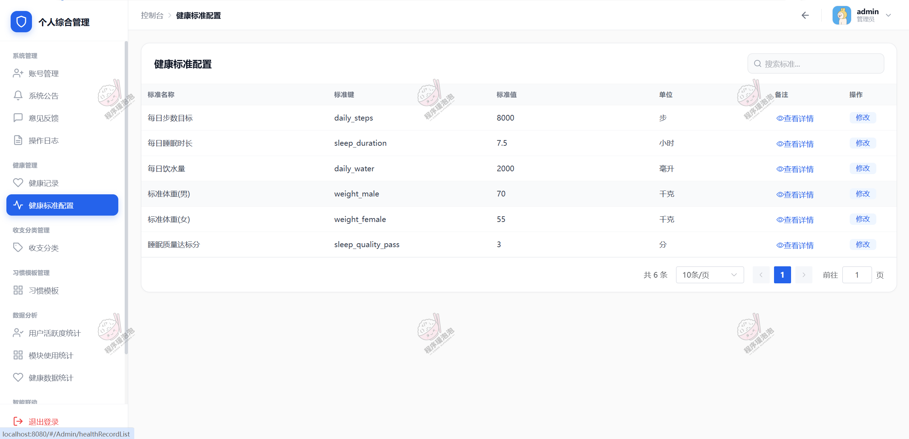

**图 14 · 平台总览**

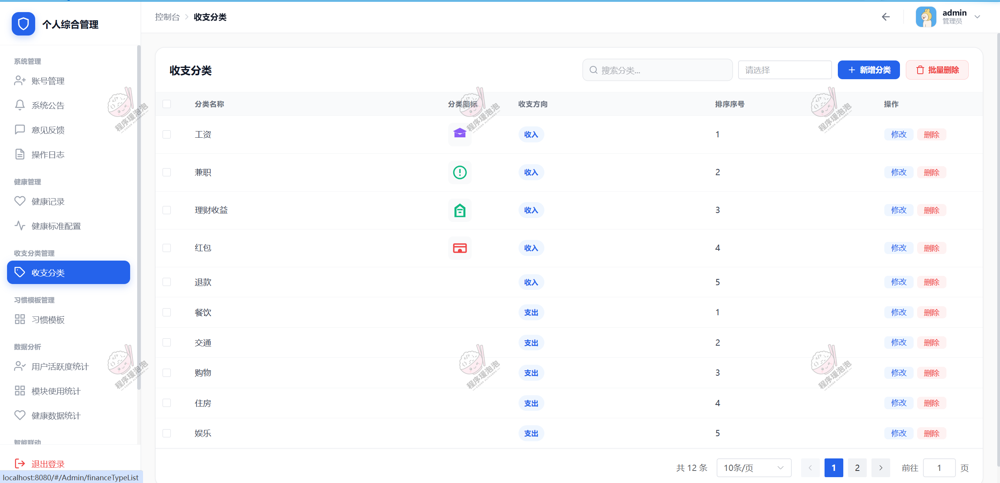

**图 15 · 平台总览**

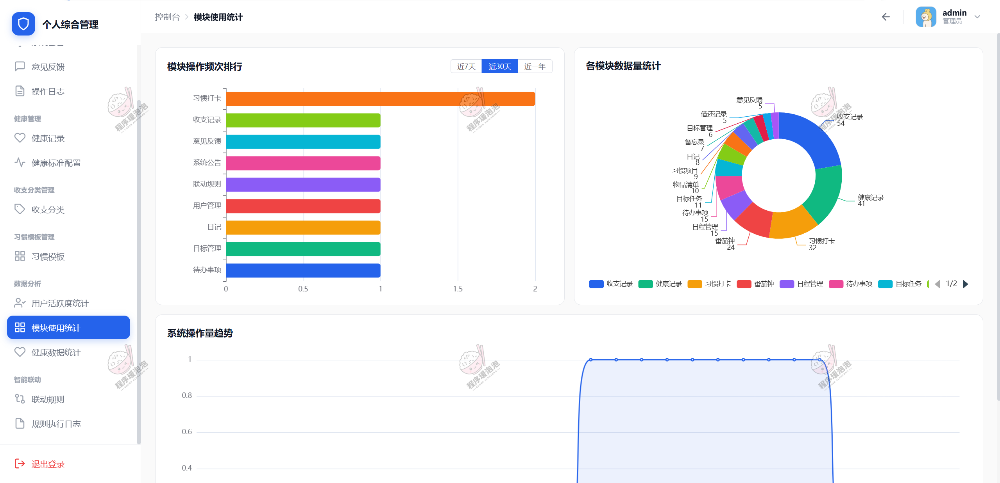

**图 16 · 平台总览**

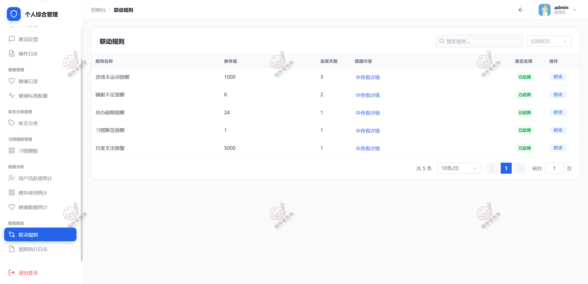

### 用户端

### 管理员端

---

> 免责声明：本文档中的系统截图与说明仅用于毕业设计成果展示与技术交流，部分界面数据为演示用途。

> 本项目仅用于学习交流，非商用、非开源、非无偿。

> 文档展示 16 张截图，需要了解更多，请联系我。
